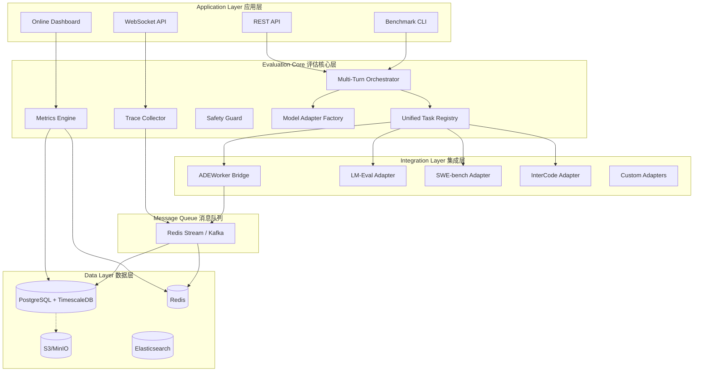
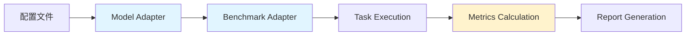
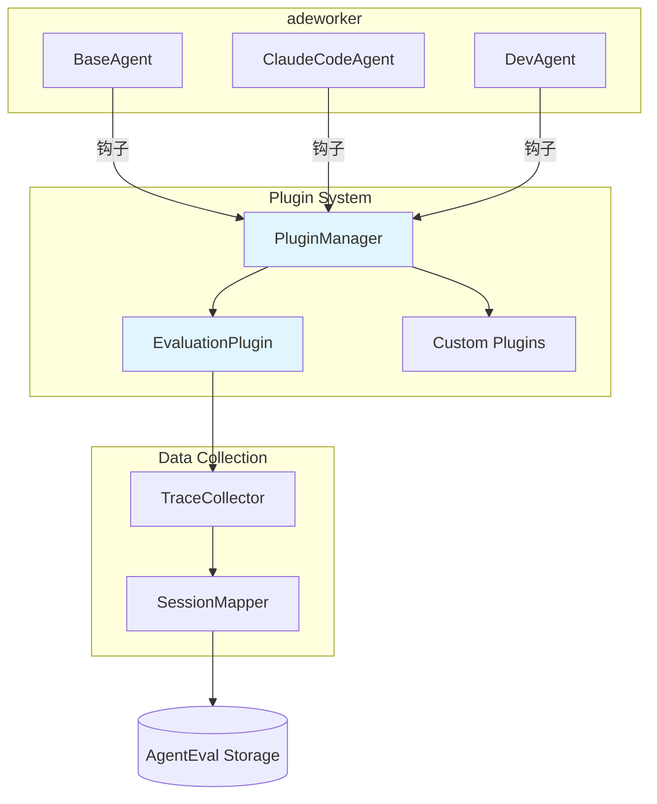
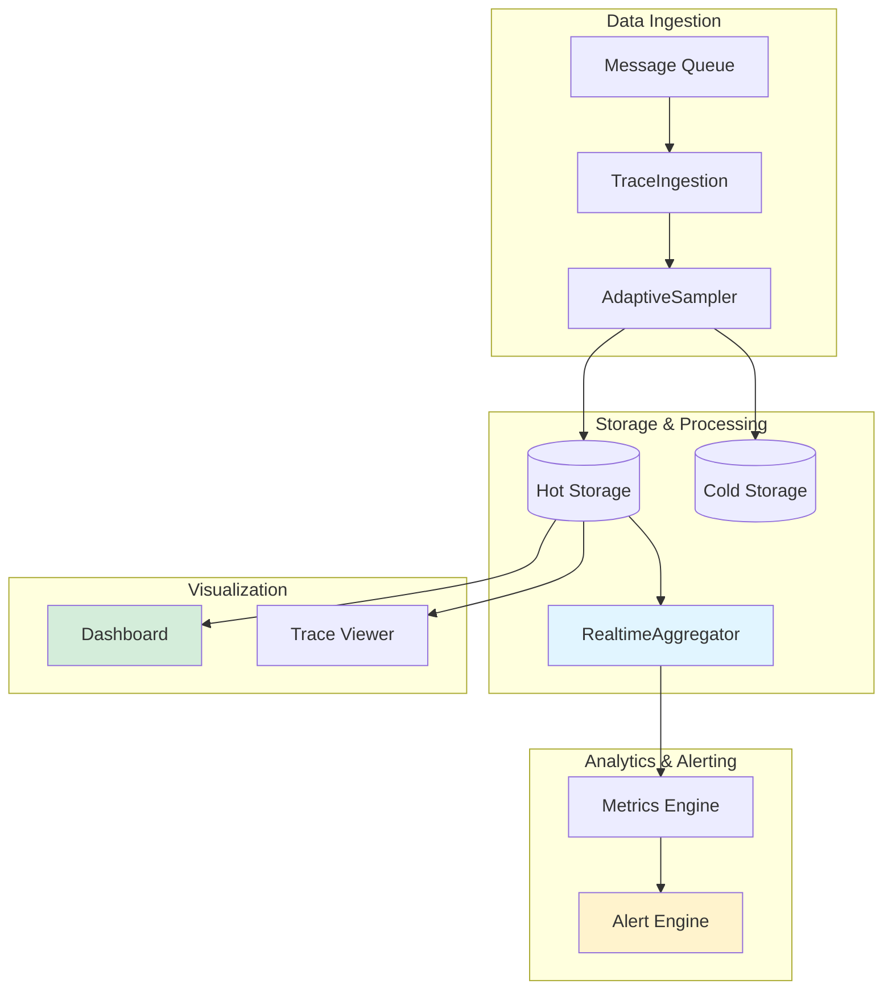

# Agent Evaluation System - 总体架构设计

**版本**: 1.0
**日期**: 2025-01-28
**状态**: 设计阶段

---

## 📋 执行概要

### 项目目标

构建一个**统一的 Agent 评估系统**，支持：
1. **Offline 模式**：基于 Benchmark 的离线评估（SWE-bench、HumanEval、InterCode 等）
2. **Online 模式**：生产环境的实时轨迹追踪与监控
3. **多模型支持**：统一接口支持 10+ LLM（GPT-4、Claude、Qwen、DeepSeek 等）
4. **深度集成**：与 adeworker 智能体框架无缝集成

### 核心价值

- ✅ **统一评估框架**：一套系统同时支持研究和生产
- ✅ **多模型横向对比**：公平、可重复的评估环境
- ✅ **可扩展架构**：轻松添加新模型、新 Benchmark、新插件
- ✅ **生产级监控**：实时指标、智能告警、轨迹回放
- ✅ **低侵入集成**：对现有系统最小化改动

---

## 🏗️ 整体架构

### 系统分层架构



---

## 🎯 三个 Milestone 的演进路径

### Milestone 1: Offline 评估引擎（7 周）

**目标**：构建完整的 Benchmark 评估能力



**核心组件**：
- **Model Adapter Factory**: 支持 10+ LLM（LiteLLM 统一封装）
- **Benchmark Adapters**: SWE-bench、InterCode、HumanEval
- **Batch Orchestrator**: 并发评估、进度追踪
- **Export Engine**: HTML/PDF/CSV 报告

**交付物**：
- 可独立运行的 CLI 工具
- 多模型对比报告
- 性能基准数据

---

### Milestone 2: adeworker 集成层（4 周）

**目标**：将评估能力集成到生产环境



**核心组件**：
- **Plugin System**: 钩子机制、生命周期管理
- **Evaluation Plugin**: 数据收集、会话映射
- **Trace Collector**: 批量上报、重试保证

**交付物**：
- adeworker 插件包
- 集成文档
- 性能开销报告（<5%）

---

### Milestone 3: Online Tracing 系统（6 周）

**目标**：生产级实时监控与告警



**核心组件**：
- **分布式追踪**: W3C Trace Context、Span 树
- **实时聚合**: 滑动窗口、百分位数计算
- **告警引擎**: 规则 DSL、多通道通知
- **Dashboard**: Streamlit/React 实时监控

**交付物**：
- 完整的追踪系统
- 实时监控 Dashboard
- 告警配置示例

---

## 🔧 技术栈选型

### 编程语言与框架

| 组件 | 技术栈 | 理由 |
|------|--------|------|
| **后端** | Python 3.10+ | 与现有系统一致 |
| **Web 框架** | FastAPI | 高性能、异步支持 |
| **任务编排** | asyncio | 原生异步支持 |
| **模型接入** | LiteLLM | 支持 100+ 模型 |
| **前端** | Streamlit / React | MVP 快速原型 / 生产版 |

### 数据存储

| 类型 | 技术 | 用途 |
|------|------|------|
| **时序数据库** | PostgreSQL + TimescaleDB | Trace、Span、Metrics 存储 |
| **缓存** | Redis | 实时指标、去重、会话映射 |
| **消息队列** | Redis Stream / Kafka | 事件流、解耦 |
| **对象存储** | S3 / MinIO | 冷数据归档 |
| **搜索引擎** | Elasticsearch（可选）| 全文搜索 |

### 基础设施

| 组件 | 技术 | 说明 |
|------|------|------|
| **容器化** | Docker | 统一运行环境 |
| **编排** | Kubernetes | 生产部署 |
| **监控** | Prometheus + Grafana | 系统监控 |
| **追踪** | OpenTelemetry | 标准化追踪 |

---

## 📊 数据流设计

### Offline 评估数据流

```
配置文件 (YAML)
    ↓
BatchOrchestrator
    ↓
[并发] 多个 Task 执行
    ├─→ Task 1: ModelAdapter.generate() → BenchmarkAdapter.evaluate()
    ├─→ Task 2: ModelAdapter.generate() → BenchmarkAdapter.evaluate()
    └─→ Task N: ...
    ↓
Metrics Engine (聚合)
    ↓
Export Engine
    ↓
报告文件 (HTML/PDF/CSV)
```

### Online 追踪数据流

```
adeworker Agent 执行
    ↓
Plugin 钩子触发
    ↓
EvaluationPlugin 收集事件
    ↓
TraceCollector 批量上报
    ↓
Message Queue (Redis Stream)
    ↓
TraceIngestion 消费
    ├─→ AdaptiveSampler 采样决策
    ├─→ DataEnricher 数据丰富
    └─→ 存储
        ├─→ PostgreSQL (结构化数据)
        ├─→ Redis (实时指标)
        └─→ S3 (归档)
    ↓
RealtimeAggregator
    ├─→ 计算实时指标
    └─→ AlertEngine 规则匹配
        ↓
        通知 (Slack/钉钉/Email)
    ↓
Dashboard 实时展示
```

---

## 🔌 可扩展性设计

### 1. LLM 扩展

**设计原则**：配置驱动，无需修改代码

```yaml
# config/models.yaml
models:
  new-model-name:
    provider: custom
    litellm_name: custom/model-id
    api_base: https://api.example.com/v1
    capabilities:
      supports_function_calling: true
      max_input_tokens: 32000
    pricing:
      input_per_1m: 1.0
      output_per_1m: 3.0
```

**步骤**：
1. 在 `models.yaml` 添加配置
2. 重启服务（或热重载）
3. 立即可用

---

### 2. Benchmark 扩展

**设计原则**：Adapter 模式，统一接口

```python
# 实现新 Adapter
class MyBenchmarkAdapter(BenchmarkAdapter):
    def get_adapter_info(self) -> AdapterInfo:
        return AdapterInfo(name="my_benchmark", version="1.0")

    def create_environment(self, config) -> UnifiedEnv:
        return MyEnvironment(config)

    def load_tasks(self, filter) -> List[BaseTask]:
        # 加载任务数据
        pass
```

**步骤**：
1. 继承 `BenchmarkAdapter`
2. 实现 5 个核心方法
3. 在 `AdapterRegistry` 注册
4. 配置文件中引用

---

### 3. 插件扩展

**设计原则**：钩子机制，用户可自定义

```python
# 自定义插件
class MyCustomPlugin(AgentPlugin):
    @property
    def metadata(self):
        return PluginMetadata(name="my_plugin", version="1.0")

    async def on_agent_start(self, context):
        # 自定义逻辑
        pass

    async def on_tool_call(self, tool_use):
        # 自定义逻辑
        pass
```

**步骤**：
1. 继承 `AgentPlugin`
2. 实现需要的钩子方法
3. 在配置文件中启用
4. 重启 adeworker

---

### 4. 告警通道扩展

**设计原则**：Notifier 基类，多通道支持

```python
# 自定义通知器
class MyNotifier(Notifier):
    async def send(self, message: str, config: Dict):
        # 发送到自定义平台
        await custom_api.send(message)
```

**步骤**：
1. 继承 `Notifier`
2. 实现 `send()` 方法
3. 在 `AlertEngine` 注册
4. 配置文件中使用

---

## 🔒 安全与性能

### 安全措施

| 层面 | 措施 |
|------|------|
| **代码执行** | Docker 沙箱隔离、资源限制 |
| **数据访问** | RBAC 权限控制、API Key 验证 |
| **敏感信息** | 环境变量管理、Secret 加密 |
| **网络** | 网络隔离、白名单机制 |

### 性能目标

| 指标 | 目标值 |
|------|--------|
| **Offline 评估吞吐** | >100 tasks/hour |
| **Online 数据摄入** | >1000 events/s |
| **Dashboard 加载** | <2s |
| **实时指标延迟** | <5s |
| **查询响应时间** | <500ms (P95) |
| **性能开销** | <5% (插件模式) |

---

## 📦 部署架构

### Docker Compose 部署（开发/小规模）

```
┌─────────────────────────────────────────┐
│        Docker Compose Stack              │
│  ┌─────────────┐  ┌──────────────────┐  │
│  │  AgentEval  │  │  adeworker       │  │
│  │  API        │  │  (with plugin)   │  │
│  └─────────────┘  └──────────────────┘  │
│  ┌─────────────┐  ┌──────────────────┐  │
│  │ PostgreSQL  │  │  Redis           │  │
│  │ +TimescaleDB│  │                  │  │
│  └─────────────┘  └──────────────────┘  │
│  ┌─────────────┐  ┌──────────────────┐  │
│  │  Dashboard  │  │  MinIO (S3)      │  │
│  └─────────────┘  └──────────────────┘  │
└─────────────────────────────────────────┘
```

### Kubernetes 部署（生产环境）

```
┌─────────────────────────────────────────────────────────┐
│                   Kubernetes Cluster                     │
│                                                           │
│  ┌─────────────────────────────────────────────────────┐│
│  │  Ingress (Nginx/Traefik)                            ││
│  └─────────────────────────────────────────────────────┘│
│                          ↓                               │
│  ┌─────────────┐  ┌──────────────┐  ┌────────────────┐ │
│  │ AgentEval   │  │  Dashboard   │  │  API Gateway   │ │
│  │ API Pod     │  │  Pod         │  │  Pod           │ │
│  │ (3 replicas)│  │  (2 replicas)│  │                │ │
│  └─────────────┘  └──────────────┘  └────────────────┘ │
│                                                           │
│  ┌─────────────┐  ┌──────────────┐  ┌────────────────┐ │
│  │ Ingestion   │  │  Aggregator  │  │  Alert Engine  │ │
│  │ Worker Pod  │  │  Pod         │  │  Pod           │ │
│  │ (5 replicas)│  │  (2 replicas)│  │                │ │
│  └─────────────┘  └──────────────┘  └────────────────┘ │
│                                                           │
│  ┌──────────────────────────────────────────────────────┐│
│  │  StatefulSet: PostgreSQL (with TimescaleDB)          ││
│  │  StatefulSet: Redis Cluster                          ││
│  │  External: S3 (AWS/MinIO)                            ││
│  │  External: Kafka (optional, for high throughput)     ││
│  └──────────────────────────────────────────────────────┘│
└─────────────────────────────────────────────────────────┘
```

---

## 🎯 成功标准

### Milestone 1 验收标准

- ✅ 支持至少 10 种 LLM
- ✅ 在 SWE-bench Lite 上完整运行
- ✅ 生成多模型对比报告
- ✅ 单元测试覆盖率 >80%

### Milestone 2 验收标准

- ✅ adeworker 可通过配置启用评估
- ✅ 数据自动上报到 AgentEval
- ✅ 性能开销 <5%
- ✅ 集成测试通过率 100%

### Milestone 3 验收标准

- ✅ Dashboard 显示实时指标（<5s 延迟）
- ✅ 支持 Trace 查询与回放
- ✅ 告警系统正常工作
- ✅ 系统可用性 >99.5%

---

## 📅 实施时间线

```
Week 1-7   : Milestone 1 (Offline 评估引擎)
Week 8-11  : Milestone 2 (adeworker 集成)
Week 12-17 : Milestone 3 (Online Tracing)
```

**总计**: 17 周（约 4 个月）

---

## 🔗 相关文档

- [Milestone 1 详细设计](./01_milestone1_offline_evaluation.md)
- [Milestone 2 详细设计](./02_milestone2_adeworker_integration.md)
- [Milestone 3 详细设计](./03_milestone3_online_tracing.md)
- [API 规范](./04_api_specification.md)
- [扩展性指南](./05_extensibility_guide.md)
- [实施计划](./06_implementation_timeline.md)
- [数据库设计](./07_database_schema.md)

---

**文档版本历史**:
- v1.0 (2025-01-28): 初始版本
