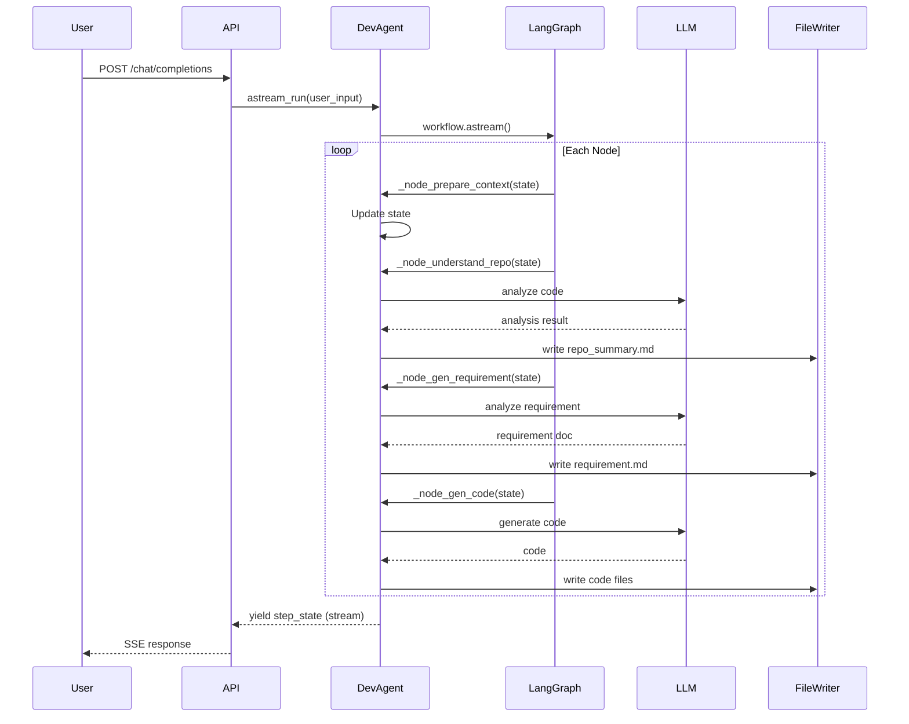

# Milestone 2: ADEWorker 集成层详细设计文档

**文档版本**: v1.0
**创建日期**: 2025-01-28
**负责人**: Evaluation Engine Team
**文档状态**: Design

---

## 📋 目录

1. [概述](#1-概述)
2. [ADEWorker 架构分析](#2-adeworker-架构分析)
3. [Plugin System 详细设计](#3-plugin-system-详细设计)
4. [Trace Collector 详细设计](#4-trace-collector-详细设计)
5. [Session Mapper 详细设计](#5-session-mapper-详细设计)
6. [数据模型设计](#6-数据模型设计)
7. [性能优化策略](#7-性能优化策略)
8. [安全与隐私](#8-安全与隐私)
9. [实施计划](#9-实施计划)
10. [测试策略](#10-测试策略)
11. [附录](#11-附录)

---

## 1. 概述

### 1.1 Milestone 2 目标

实现与 adeworker Agent 框架的**低侵入、高性能**集成，通过插件机制自动收集 Agent 执行轨迹数据，为 Milestone 3 的在线监控系统提供数据基础。

**核心目标**:
- ✅ 实现 Plugin System，支持动态加载与卸载
- ✅ 实现 Trace Collector，自动收集 Agent 执行数据
- ✅ 实现 Session Mapper，建立会话与轨迹的映射关系
- ✅ **性能开销 < 5%**（关键指标）
- ✅ 提供完整的集成文档与示例代码

### 1.2 设计原则

| 原则 | 说明 | 实现方式 |
|------|------|----------|
| **低侵入性** | 最小化对 adeworker 代码的修改 | 基于钩子机制，无需修改核心逻辑 |
| **高性能** | 性能开销 < 5% | 异步批量上报、本地缓存、智能采样 |
| **可配置** | 支持灵活的开关与参数调整 | YAML 配置文件 + 环境变量 |
| **容错性** | 插件异常不影响 Agent 正常运行 | 异常捕获、降级策略、本地缓存 |
| **可扩展** | 易于添加新的钩子与指标 | 标准化接口 + 插件注册机制 |

### 1.3 交付物清单

- [ ] `agenteval-plugin` Python 包（可通过 pip 安装）
- [ ] Plugin System 核心代码
- [ ] Trace Collector 实现
- [ ] Session Mapper 实现
- [ ] 集成示例代码
- [ ] 单元测试与集成测试（覆盖率 > 80%）
- [ ] 集成文档（README + 集成指南）
- [ ] 性能 Benchmark 报告

---

## 2. ADEWorker 架构分析

### 2.1 核心架构

基于代码分析，adeworker 采用以下架构：

```
┌─────────────────────────────────────────────────────────────┐
│                    ADEWorker 架构                            │
│  ┌──────────────────────────────────────────────────────┐  │
│  │  API Layer (FastAPI)                                 │  │
│  │  ├─ /api/cline/openai_compatible/v1/chat/completions│  │
│  │  └─ /api/agent/...                                   │  │
│  └──────────────────────────────────────────────────────┘  │
│                          ↓                                  │
│  ┌──────────────────────────────────────────────────────┐  │
│  │  Agent Layer                                         │  │
│  │  ├─ BaseAgent (chat / arun / astream_run)           │  │
│  │  ├─ DevAgent (LangGraph StateGraph)                 │  │
│  │  │   ├─ _node_prepare_context                       │  │
│  │  │   ├─ _node_understand_repo                       │  │
│  │  │   ├─ _node_gen_requirement                       │  │
│  │  │   ├─ _node_gen_solution                          │  │
│  │  │   ├─ _node_gen_code                              │  │
│  │  │   └─ _node_execute_code                          │  │
│  │  └─ MicroAgents (RepoAnalysis, TechDesign, Coder)   │  │
│  └──────────────────────────────────────────────────────┘  │
│                          ↓                                  │
│  ┌──────────────────────────────────────────────────────┐  │
│  │  Infrastructure Layer                                │  │
│  │  ├─ LLM (LangChain + LiteLLM)                        │  │
│  │  ├─ Repository Manager (FileReader/Writer)          │  │
│  │  ├─ Docker Runtime Env                               │  │
│  │  ├─ Session Manager (DB + Workspace)                │  │
│  │  └─ Memory Store                                     │  │
│  └──────────────────────────────────────────────────────┘  │
└─────────────────────────────────────────────────────────────┘
```

### 2.2 关键组件分析

#### 2.2.1 BaseAgent
- **位置**: `backend/worker/agent/agent_base/base_agent.py`
- **核心方法**:
  - `arun(user_input)`: 异步执行任务（非流式）
  - `astream_run(user_input)`: 异步执行任务（流式输出）
  - `chat(chat_input)`: 聊天模式
  - `interrupt_task(task_id)`: 中断任务

- **集成点**: 在 `arun` 和 `astream_run` 的入口/出口插入钩子

#### 2.2.2 DevAgent (LangGraph)
- **位置**: `backend/worker/agent/dev_agent/agent.py`
- **核心特性**:
  - 使用 LangGraph 构建状态图
  - 多节点流程：prepare → understand → requirement → solution → code → execute
  - 使用 `InMemorySaver` 作为 checkpointer

- **集成点**:
  - 在每个节点的前后插入钩子（node_start / node_end）
  - 在状态更新时插入钩子（state_update）

#### 2.2.3 Session Manager
- **位置**: `backend/worker/session/session_manager.py`
- **核心功能**:
  - 创建/查询/更新会话
  - 管理 workspace 与 git repository
  - 会话状态管理（creating/created/exception）

- **集成点**: Session 创建时初始化 Trace Context

#### 2.2.4 LLM Integration (LangChain)
- **位置**: `backend/worker/infra/llm/`
- **核心特性**:
  - 基于 LangChain 封装 LLM 调用
  - 支持流式输出

- **集成点**: LLM 调用前后插入钩子（llm_start / llm_end）

### 2.3 执行流程分析



### 2.4 插件集成策略

基于架构分析，我们采用 **装饰器 + 回调** 混合模式：

1. **装饰器模式**: 包装 `arun` / `astream_run` / 各节点方法
2. **回调模式**: LangChain 原生支持 Callbacks（LLM 调用）
3. **猴子补丁** (可选): 极少数无法通过装饰器处理的场景

---

## 3. Plugin System 详细设计

### 3.1 整体架构

```
┌────────────────────────────────────────────────────────────┐
│              AgentEval Plugin System                        │
│  ┌──────────────────────────────────────────────────────┐  │
│  │  Plugin Manager                                      │  │
│  │  ├─ register_plugin(plugin)                          │  │
│  │  ├─ unregister_plugin(plugin_id)                     │  │
│  │  ├─ enable_plugin(plugin_id)                         │  │
│  │  ├─ disable_plugin(plugin_id)                        │  │
│  │  └─ get_active_plugins()                             │  │
│  └──────────────────────────────────────────────────────┘  │
│                          ↓                                  │
│  ┌──────────────────────────────────────────────────────┐  │
│  │  Hook Registry                                       │  │
│  │  ├─ on_agent_start                                   │  │
│  │  ├─ on_agent_end                                     │  │
│  │  ├─ on_node_start                                    │  │
│  │  ├─ on_node_end                                      │  │
│  │  ├─ on_llm_start                                     │  │
│  │  ├─ on_llm_end                                       │  │
│  │  ├─ on_tool_call                                     │  │
│  │  ├─ on_state_update                                  │  │
│  │  └─ on_error                                         │  │
│  └──────────────────────────────────────────────────────┘  │
│                          ↓                                  │
│  ┌──────────────────────────────────────────────────────┐  │
│  │  Concrete Plugins                                    │  │
│  │  ├─ EvaluationPlugin (核心插件)                      │  │
│  │  ├─ MetricsPlugin (可选)                             │  │
│  │  └─ CustomPlugin (用户自定义)                        │  │
│  └──────────────────────────────────────────────────────┘  │
└────────────────────────────────────────────────────────────┘
```

### 3.2 核心接口设计

#### 3.2.1 Plugin Base Class

```python
# agenteval_plugin/core/plugin_base.py

from abc import ABC, abstractmethod
from typing import Any, Dict, Optional
from pydantic import BaseModel

class PluginMetadata(BaseModel):
    """插件元信息"""
    id: str  # 唯一标识
    name: str
    version: str
    description: str
    author: str
    dependencies: list[str] = []  # 依赖的其他插件

class PluginConfig(BaseModel):
    """插件配置"""
    enabled: bool = True
    priority: int = 100  # 优先级（数字越小优先级越高）
    sampling_rate: float = 1.0  # 采样率（0.0-1.0）
    async_mode: bool = True  # 是否异步执行
    extra: Dict[str, Any] = {}  # 额外配置

class AgentContext(BaseModel):
    """Agent 上下文"""
    agent_id: str
    agent_type: str  # DevAgent, ChatAgent, etc.
    agent_version: str
    session_id: str
    user_id: str
    task_id: str
    workspace_path: str
    start_time: float
    metadata: Dict[str, Any] = {}

class NodeContext(BaseModel):
    """节点上下文"""
    node_name: str
    start_time: float
    input_state: Dict[str, Any]

class LLMContext(BaseModel):
    """LLM 调用上下文"""
    model_name: str
    prompt: str
    temperature: float
    max_tokens: int
    start_time: float

class ToolContext(BaseModel):
    """工具调用上下文"""
    tool_name: str
    tool_input: Dict[str, Any]
    start_time: float

class BasePlugin(ABC):
    """插件基类"""

    def __init__(self, config: Optional[PluginConfig] = None):
        self.config = config or PluginConfig()
        self._enabled = self.config.enabled

    @property
    @abstractmethod
    def metadata(self) -> PluginMetadata:
        """返回插件元信息"""
        pass

    # ===== 生命周期钩子 =====

    async def on_agent_start(self, context: AgentContext) -> None:
        """Agent 启动时触发"""
        pass

    async def on_agent_end(
        self,
        context: AgentContext,
        result: Any,
        error: Optional[Exception] = None
    ) -> None:
        """Agent 结束时触发"""
        pass

    async def on_node_start(
        self,
        agent_context: AgentContext,
        node_context: NodeContext
    ) -> None:
        """节点开始时触发"""
        pass

    async def on_node_end(
        self,
        agent_context: AgentContext,
        node_context: NodeContext,
        output_state: Dict[str, Any],
        error: Optional[Exception] = None
    ) -> None:
        """节点结束时触发"""
        pass

    async def on_llm_start(
        self,
        agent_context: AgentContext,
        llm_context: LLMContext
    ) -> None:
        """LLM 调用开始时触发"""
        pass

    async def on_llm_end(
        self,
        agent_context: AgentContext,
        llm_context: LLMContext,
        response: str,
        token_usage: Dict[str, int],
        error: Optional[Exception] = None
    ) -> None:
        """LLM 调用结束时触发"""
        pass

    async def on_tool_call(
        self,
        agent_context: AgentContext,
        tool_context: ToolContext,
        result: Any,
        error: Optional[Exception] = None
    ) -> None:
        """工具调用时触发"""
        pass

    async def on_state_update(
        self,
        agent_context: AgentContext,
        old_state: Dict[str, Any],
        new_state: Dict[str, Any]
    ) -> None:
        """状态更新时触发"""
        pass

    async def on_error(
        self,
        agent_context: AgentContext,
        error: Exception,
        error_context: Dict[str, Any]
    ) -> None:
        """错误发生时触发"""
        pass

    # ===== 辅助方法 =====

    def should_process(self) -> bool:
        """判断是否应该处理（考虑采样率）"""
        if not self._enabled:
            return False

        if self.config.sampling_rate >= 1.0:
            return True

        import random
        return random.random() < self.config.sampling_rate

    async def cleanup(self) -> None:
        """清理资源（插件卸载时调用）"""
        pass
```

#### 3.2.2 Plugin Manager

```python
# agenteval_plugin/core/plugin_manager.py

import asyncio
from typing import Dict, List, Optional, Type
from contextlib import asynccontextmanager
from .plugin_base import BasePlugin, PluginMetadata, AgentContext
from ..utils.logging import get_logger

logger = get_logger(__name__)

class PluginManager:
    """插件管理器（单例模式）"""

    _instance: Optional['PluginManager'] = None

    def __new__(cls):
        if cls._instance is None:
            cls._instance = super().__new__(cls)
            cls._instance._initialized = False
        return cls._instance

    def __init__(self):
        if self._initialized:
            return

        self._plugins: Dict[str, BasePlugin] = {}
        self._enabled_plugins: Dict[str, BasePlugin] = {}
        self._hook_handlers: Dict[str, List[BasePlugin]] = {
            'on_agent_start': [],
            'on_agent_end': [],
            'on_node_start': [],
            'on_node_end': [],
            'on_llm_start': [],
            'on_llm_end': [],
            'on_tool_call': [],
            'on_state_update': [],
            'on_error': []
        }
        self._initialized = True

    def register_plugin(self, plugin: BasePlugin) -> None:
        """注册插件"""
        metadata = plugin.metadata
        plugin_id = metadata.id

        if plugin_id in self._plugins:
            logger.warning(f"Plugin {plugin_id} already registered, replacing...")

        self._plugins[plugin_id] = plugin

        if plugin.config.enabled:
            self.enable_plugin(plugin_id)

        logger.info(f"Registered plugin: {metadata.name} v{metadata.version}")

    def unregister_plugin(self, plugin_id: str) -> None:
        """注销插件"""
        if plugin_id in self._enabled_plugins:
            self.disable_plugin(plugin_id)

        if plugin_id in self._plugins:
            plugin = self._plugins.pop(plugin_id)
            asyncio.create_task(plugin.cleanup())
            logger.info(f"Unregistered plugin: {plugin_id}")

    def enable_plugin(self, plugin_id: str) -> None:
        """启用插件"""
        if plugin_id not in self._plugins:
            raise ValueError(f"Plugin {plugin_id} not registered")

        plugin = self._plugins[plugin_id]
        self._enabled_plugins[plugin_id] = plugin

        # 添加到钩子处理列表
        for hook_name in self._hook_handlers.keys():
            if hasattr(plugin, hook_name):
                self._hook_handlers[hook_name].append(plugin)

        # 按优先级排序
        for handlers in self._hook_handlers.values():
            handlers.sort(key=lambda p: p.config.priority)

        logger.info(f"Enabled plugin: {plugin_id}")

    def disable_plugin(self, plugin_id: str) -> None:
        """禁用插件"""
        if plugin_id not in self._enabled_plugins:
            return

        plugin = self._enabled_plugins.pop(plugin_id)

        # 从钩子处理列表中移除
        for handlers in self._hook_handlers.values():
            if plugin in handlers:
                handlers.remove(plugin)

        logger.info(f"Disabled plugin: {plugin_id}")

    def get_plugin(self, plugin_id: str) -> Optional[BasePlugin]:
        """获取插件实例"""
        return self._plugins.get(plugin_id)

    def get_active_plugins(self) -> List[BasePlugin]:
        """获取所有激活的插件"""
        return list(self._enabled_plugins.values())

    # ===== 钩子触发方法 =====

    async def trigger_agent_start(self, context: AgentContext) -> None:
        """触发 on_agent_start 钩子"""
        await self._trigger_hook('on_agent_start', context)

    async def trigger_agent_end(
        self,
        context: AgentContext,
        result: any,
        error: Optional[Exception] = None
    ) -> None:
        """触发 on_agent_end 钩子"""
        await self._trigger_hook('on_agent_end', context, result, error=error)

    async def trigger_node_start(self, agent_context, node_context) -> None:
        """触发 on_node_start 钩子"""
        await self._trigger_hook('on_node_start', agent_context, node_context)

    async def trigger_node_end(
        self,
        agent_context,
        node_context,
        output_state,
        error: Optional[Exception] = None
    ) -> None:
        """触发 on_node_end 钩子"""
        await self._trigger_hook(
            'on_node_end',
            agent_context,
            node_context,
            output_state,
            error=error
        )

    async def trigger_llm_start(self, agent_context, llm_context) -> None:
        """触发 on_llm_start 钩子"""
        await self._trigger_hook('on_llm_start', agent_context, llm_context)

    async def trigger_llm_end(
        self,
        agent_context,
        llm_context,
        response: str,
        token_usage: Dict[str, int],
        error: Optional[Exception] = None
    ) -> None:
        """触发 on_llm_end 钩子"""
        await self._trigger_hook(
            'on_llm_end',
            agent_context,
            llm_context,
            response,
            token_usage,
            error=error
        )

    async def trigger_tool_call(
        self,
        agent_context,
        tool_context,
        result: any,
        error: Optional[Exception] = None
    ) -> None:
        """触发 on_tool_call 钩子"""
        await self._trigger_hook(
            'on_tool_call',
            agent_context,
            tool_context,
            result,
            error=error
        )

    async def trigger_state_update(
        self,
        agent_context,
        old_state: Dict,
        new_state: Dict
    ) -> None:
        """触发 on_state_update 钩子"""
        await self._trigger_hook(
            'on_state_update',
            agent_context,
            old_state,
            new_state
        )

    async def trigger_error(
        self,
        agent_context,
        error: Exception,
        error_context: Dict
    ) -> None:
        """触发 on_error 钩子"""
        await self._trigger_hook(
            'on_error',
            agent_context,
            error,
            error_context
        )

    async def _trigger_hook(self, hook_name: str, *args, **kwargs) -> None:
        """通用钩子触发方法"""
        handlers = self._hook_handlers.get(hook_name, [])

        tasks = []
        for plugin in handlers:
            if not plugin.should_process():
                continue

            try:
                handler = getattr(plugin, hook_name)
                if plugin.config.async_mode:
                    # 异步执行，不阻塞主流程
                    tasks.append(asyncio.create_task(
                        self._safe_execute(handler, *args, **kwargs)
                    ))
                else:
                    # 同步执行
                    await self._safe_execute(handler, *args, **kwargs)
            except Exception as e:
                logger.error(
                    f"Error triggering {hook_name} on plugin {plugin.metadata.id}: {e}",
                    exc_info=True
                )

        # 等待所有异步任务（但不阻塞太久）
        if tasks:
            await asyncio.gather(*tasks, return_exceptions=True)

    async def _safe_execute(self, handler, *args, **kwargs):
        """安全执行钩子处理函数（捕获异常）"""
        try:
            await handler(*args, **kwargs)
        except Exception as e:
            logger.error(f"Error in plugin hook: {e}", exc_info=True)

    @asynccontextmanager
    async def agent_context(self, context: AgentContext):
        """Agent 上下文管理器"""
        await self.trigger_agent_start(context)
        result = None
        error = None
        try:
            yield
        except Exception as e:
            error = e
            raise
        finally:
            await self.trigger_agent_end(context, result, error)

# 全局单例
plugin_manager = PluginManager()
```

### 3.3 装饰器实现

```python
# agenteval_plugin/decorators.py

import time
import functools
from typing import Callable, Optional
from .core.plugin_manager import plugin_manager
from .core.plugin_base import AgentContext, NodeContext, LLMContext
from .utils.logging import get_logger

logger = get_logger(__name__)

def instrument_agent(
    agent_type: str,
    agent_version: str = "1.0.0"
):
    """装饰 Agent 的 arun / astream_run 方法"""
    def decorator(func: Callable):
        @functools.wraps(func)
        async def wrapper(self, user_input, *args, **kwargs):
            # 构造 AgentContext
            context = AgentContext(
                agent_id=f"{agent_type}_{user_input.task_id}",
                agent_type=agent_type,
                agent_version=agent_version,
                session_id=getattr(user_input, 'session_id', ''),
                user_id=getattr(user_input, 'user_id', ''),
                task_id=user_input.task_id,
                workspace_path=getattr(user_input, 'repo_ws_path', ''),
                start_time=time.time(),
                metadata={
                    'task_desc': getattr(user_input, 'task_desc', ''),
                }
            )

            # 触发 on_agent_start
            await plugin_manager.trigger_agent_start(context)

            result = None
            error = None
            try:
                # 执行原方法
                result = await func(self, user_input, *args, **kwargs)
                return result
            except Exception as e:
                error = e
                raise
            finally:
                # 触发 on_agent_end
                await plugin_manager.trigger_agent_end(context, result, error)

        return wrapper
    return decorator

def instrument_node(node_name: str):
    """装饰 LangGraph 节点方法"""
    def decorator(func: Callable):
        @functools.wraps(func)
        async def wrapper(self, state, *args, **kwargs):
            # 从 state 中提取 AgentContext
            agent_context = getattr(state, '_agent_context', None)
            if not agent_context:
                # 如果没有 context，直接执行
                return await func(self, state, *args, **kwargs)

            # 构造 NodeContext
            node_context = NodeContext(
                node_name=node_name,
                start_time=time.time(),
                input_state=state.dict() if hasattr(state, 'dict') else {}
            )

            # 触发 on_node_start
            await plugin_manager.trigger_node_start(agent_context, node_context)

            output_state = None
            error = None
            try:
                # 执行原方法
                output_state = await func(self, state, *args, **kwargs)
                return output_state
            except Exception as e:
                error = e
                raise
            finally:
                # 触发 on_node_end
                await plugin_manager.trigger_node_end(
                    agent_context,
                    node_context,
                    output_state.dict() if hasattr(output_state, 'dict') else {},
                    error
                )

        return wrapper
    return decorator

def instrument_llm_call():
    """装饰 LLM 调用方法"""
    def decorator(func: Callable):
        @functools.wraps(func)
        async def wrapper(self, *args, **kwargs):
            # 提取参数
            prompt = kwargs.get('prompt', '')
            model_name = kwargs.get('model', 'unknown')

            # 构造 LLMContext
            llm_context = LLMContext(
                model_name=model_name,
                prompt=prompt,
                temperature=kwargs.get('temperature', 0.7),
                max_tokens=kwargs.get('max_tokens', 4096),
                start_time=time.time()
            )

            # TODO: 从线程局部变量获取 AgentContext
            agent_context = getattr(self, '_agent_context', None)

            if agent_context:
                await plugin_manager.trigger_llm_start(agent_context, llm_context)

            response = None
            error = None
            try:
                response = await func(self, *args, **kwargs)
                return response
            except Exception as e:
                error = e
                raise
            finally:
                if agent_context:
                    token_usage = {}  # TODO: 提取 token usage
                    await plugin_manager.trigger_llm_end(
                        agent_context,
                        llm_context,
                        response or "",
                        token_usage,
                        error
                    )

        return wrapper
    return decorator
```

### 3.4 配置系统

```yaml
# config/agenteval_plugin.yaml

# 全局配置
global:
  enabled: true
  log_level: INFO
  log_file: /var/log/agenteval/plugin.log

# Trace Collector 配置
trace_collector:
  enabled: true
  # 上报端点
  endpoint: "http://localhost:8000/api/v1/traces"
  # API Key
  api_key: "${AGENTEVAL_API_KEY}"

  # 批量上报配置
  batch:
    max_size: 100          # 批量大小
    max_wait_seconds: 1.0  # 最大等待时间（秒）
    max_queue_size: 10000  # 队列最大长度

  # 重试配置
  retry:
    max_attempts: 3
    backoff_factor: 2.0
    max_backoff_seconds: 60

  # 采样配置
  sampling:
    rate: 1.0  # 全量采样（1.0 = 100%）
    # 智能采样规则（可选）
    rules:
      - condition: "error == true"
        rate: 1.0  # 错误场景全量采样
      - condition: "duration > 60"
        rate: 1.0  # 长时任务全量采样
      - condition: "task_type == 'test'"
        rate: 0.1  # 测试任务 10% 采样

  # 本地缓存配置（当无法上报时）
  local_cache:
    enabled: true
    cache_dir: /tmp/agenteval_cache
    max_size_mb: 1000
    ttl_hours: 24

# 数据脱敏配置
privacy:
  enabled: true
  # 敏感字段过滤
  sensitive_fields:
    - "password"
    - "token"
    - "api_key"
    - "secret"
  # 正则替换规则
  redact_patterns:
    - pattern: "sk-[a-zA-Z0-9]{32,}"  # OpenAI API Key
      replacement: "sk-***REDACTED***"
    - pattern: "ghp_[a-zA-Z0-9]{36}"   # GitHub Token
      replacement: "ghp_***REDACTED***"

# 性能优化配置
performance:
  async_mode: true
  max_concurrent_uploads: 5
  use_compression: true  # 压缩上报数据

# 插件配置
plugins:
  - id: "evaluation_plugin"
    enabled: true
    priority: 100
    sampling_rate: 1.0
    async_mode: true
```

---

## 4. Trace Collector 详细设计

### 4.1 架构设计

```
┌────────────────────────────────────────────────────────┐
│               Trace Collector 架构                      │
│  ┌──────────────────────────────────────────────────┐  │
│  │  Event Producer (插件钩子)                       │  │
│  │  ├─ on_agent_start → TraceEvent                  │  │
│  │  ├─ on_node_start → SpanEvent                    │  │
│  │  ├─ on_llm_call → LLMEvent                       │  │
│  │  └─ ...                                           │  │
│  └──────────────────────────────────────────────────┘  │
│                          ↓                              │
│  ┌──────────────────────────────────────────────────┐  │
│  │  Event Buffer (异步队列)                         │  │
│  │  ├─ asyncio.Queue (max_size=10000)               │  │
│  │  └─ 批量触发条件：size>=100 OR wait>=1s          │  │
│  └──────────────────────────────────────────────────┘  │
│                          ↓                              │
│  ┌──────────────────────────────────────────────────┐  │
│  │  Data Processor                                  │  │
│  │  ├─ 数据脱敏（Privacy Filter）                   │  │
│  │  ├─ 数据压缩（gzip）                             │  │
│  │  └─ 数据序列化（JSON）                           │  │
│  └──────────────────────────────────────────────────┘  │
│                          ↓                              │
│  ┌──────────────────────────────────────────────────┐  │
│  │  Uploader (HTTP Client)                          │  │
│  │  ├─ 批量上报（POST /api/v1/traces）              │  │
│  │  ├─ 重试机制（指数退避）                         │  │
│  │  └─ 超时控制（30s）                              │  │
│  └──────────────────────────────────────────────────┘  │
│                          ↓                              │
│  ┌──────────────────────────────────────────────────┐  │
│  │  Fallback Handler                                │  │
│  │  ├─ 上报失败 → 本地缓存                          │  │
│  │  └─ 定时重试（每 5 分钟）                        │  │
│  └──────────────────────────────────────────────────┘  │
└────────────────────────────────────────────────────────┘
```

### 4.2 核心实现

```python
# agenteval_plugin/trace/trace_collector.py

import asyncio
import time
import gzip
import json
from typing import List, Dict, Any, Optional
from dataclasses import dataclass, asdict
from collections import deque
from ..utils.logging import get_logger
from ..utils.http_client import AsyncHTTPClient

logger = get_logger(__name__)

@dataclass
class TraceEvent:
    """Trace 事件"""
    trace_id: str
    span_id: str
    parent_span_id: Optional[str]
    name: str
    start_time: float
    end_time: Optional[float]
    attributes: Dict[str, Any]
    events: List[Dict[str, Any]]
    status: str = "ok"  # ok, error

class TraceCollector:
    """轨迹收集器"""

    def __init__(self, config: Dict[str, Any]):
        self.config = config
        self.enabled = config.get('enabled', True)

        # 批量配置
        batch_config = config.get('batch', {})
        self.max_batch_size = batch_config.get('max_size', 100)
        self.max_wait_seconds = batch_config.get('max_wait_seconds', 1.0)
        self.max_queue_size = batch_config.get('max_queue_size', 10000)

        # 队列
        self.event_queue: asyncio.Queue = asyncio.Queue(maxsize=self.max_queue_size)
        self.batch_buffer: List[TraceEvent] = []
        self.last_flush_time = time.time()

        # HTTP 客户端
        self.http_client = AsyncHTTPClient(
            base_url=config.get('endpoint'),
            api_key=config.get('api_key'),
            timeout=30
        )

        # 后台任务
        self.background_task: Optional[asyncio.Task] = None

        # 本地缓存（失败时使用）
        self.local_cache_enabled = config.get('local_cache', {}).get('enabled', True)
        self.cache_dir = config.get('local_cache', {}).get('cache_dir', '/tmp/agenteval_cache')
        self.failed_batches: deque = deque(maxlen=1000)

    async def start(self):
        """启动收集器"""
        if not self.enabled:
            logger.info("TraceCollector is disabled")
            return

        logger.info("Starting TraceCollector...")
        self.background_task = asyncio.create_task(self._batch_worker())

    async def stop(self):
        """停止收集器"""
        if self.background_task:
            self.background_task.cancel()
            try:
                await self.background_task
            except asyncio.CancelledError:
                pass

        # 清空队列
        await self._flush()
        logger.info("TraceCollector stopped")

    async def collect(self, event: TraceEvent):
        """收集事件（非阻塞）"""
        if not self.enabled:
            return

        try:
            self.event_queue.put_nowait(event)
        except asyncio.QueueFull:
            logger.warning("Event queue is full, dropping event")

    async def _batch_worker(self):
        """后台批量处理线程"""
        while True:
            try:
                # 等待事件或超时
                try:
                    event = await asyncio.wait_for(
                        self.event_queue.get(),
                        timeout=self.max_wait_seconds
                    )
                    self.batch_buffer.append(event)
                except asyncio.TimeoutError:
                    pass

                # 检查是否需要 flush
                should_flush = (
                    len(self.batch_buffer) >= self.max_batch_size or
                    (len(self.batch_buffer) > 0 and
                     time.time() - self.last_flush_time >= self.max_wait_seconds)
                )

                if should_flush:
                    await self._flush()

            except Exception as e:
                logger.error(f"Error in batch worker: {e}", exc_info=True)

    async def _flush(self):
        """刷新批量数据"""
        if not self.batch_buffer:
            return

        batch = self.batch_buffer[:]
        self.batch_buffer.clear()
        self.last_flush_time = time.time()

        logger.debug(f"Flushing {len(batch)} events...")

        # 数据处理
        processed_data = self._process_batch(batch)

        # 上报
        success = await self._upload(processed_data)

        if not success:
            # 失败时缓存
            if self.local_cache_enabled:
                self._cache_failed_batch(processed_data)

    def _process_batch(self, batch: List[TraceEvent]) -> Dict[str, Any]:
        """处理批量数据"""
        # 转换为字典
        traces = [asdict(event) for event in batch]

        # 数据脱敏
        traces = self._redact_sensitive_data(traces)

        # 压缩
        data = json.dumps({'traces': traces})
        if self.config.get('performance', {}).get('use_compression', True):
            data = gzip.compress(data.encode('utf-8'))

        return {
            'data': data,
            'compressed': True,
            'count': len(traces)
        }

    def _redact_sensitive_data(self, traces: List[Dict]) -> List[Dict]:
        """数据脱敏"""
        privacy_config = self.config.get('privacy', {})
        if not privacy_config.get('enabled', True):
            return traces

        import re
        sensitive_fields = privacy_config.get('sensitive_fields', [])
        patterns = privacy_config.get('redact_patterns', [])

        def redact_dict(d: Dict) -> Dict:
            result = {}
            for k, v in d.items():
                # 过滤敏感字段
                if k.lower() in sensitive_fields:
                    result[k] = "***REDACTED***"
                elif isinstance(v, dict):
                    result[k] = redact_dict(v)
                elif isinstance(v, str):
                    # 正则替换
                    for pattern_config in patterns:
                        v = re.sub(
                            pattern_config['pattern'],
                            pattern_config['replacement'],
                            v
                        )
                    result[k] = v
                else:
                    result[k] = v
            return result

        return [redact_dict(trace) for trace in traces]

    async def _upload(self, data: Dict[str, Any]) -> bool:
        """上传数据"""
        retry_config = self.config.get('retry', {})
        max_attempts = retry_config.get('max_attempts', 3)
        backoff_factor = retry_config.get('backoff_factor', 2.0)

        for attempt in range(max_attempts):
            try:
                response = await self.http_client.post(
                    '/api/v1/traces',
                    data=data['data'],
                    headers={
                        'Content-Encoding': 'gzip' if data['compressed'] else 'identity'
                    }
                )

                if response.status_code == 200:
                    logger.debug(f"Uploaded {data['count']} traces successfully")
                    return True
                else:
                    logger.warning(f"Upload failed with status {response.status_code}")

            except Exception as e:
                logger.error(f"Upload attempt {attempt + 1} failed: {e}")

            # 指数退避
            if attempt < max_attempts - 1:
                wait_time = min(
                    backoff_factor ** attempt,
                    retry_config.get('max_backoff_seconds', 60)
                )
                await asyncio.sleep(wait_time)

        logger.error(f"Failed to upload after {max_attempts} attempts")
        return False

    def _cache_failed_batch(self, data: Dict[str, Any]):
        """缓存失败的批次"""
        try:
            import os
            os.makedirs(self.cache_dir, exist_ok=True)

            filename = f"{self.cache_dir}/failed_{int(time.time())}.json.gz"
            with open(filename, 'wb') as f:
                f.write(data['data'] if isinstance(data['data'], bytes) else data['data'].encode())

            self.failed_batches.append(filename)
            logger.info(f"Cached failed batch to {filename}")
        except Exception as e:
            logger.error(f"Failed to cache batch: {e}")

# 全局单例
_trace_collector: Optional[TraceCollector] = None

def get_trace_collector(config: Optional[Dict] = None) -> TraceCollector:
    """获取 TraceCollector 单例"""
    global _trace_collector
    if _trace_collector is None:
        if config is None:
            raise ValueError("TraceCollector not initialized")
        _trace_collector = TraceCollector(config)
    return _trace_collector
```

### 4.3 EvaluationPlugin 实现

```python
# agenteval_plugin/plugins/evaluation_plugin.py

import time
import uuid
from typing import Any, Dict, Optional
from ..core.plugin_base import (
    BasePlugin, PluginMetadata, PluginConfig,
    AgentContext, NodeContext, LLMContext, ToolContext
)
from ..trace.trace_collector import TraceEvent, get_trace_collector
from ..utils.logging import get_logger

logger = get_logger(__name__)

class EvaluationPlugin(BasePlugin):
    """评估插件（核心插件）"""

    def __init__(self, config: Optional[PluginConfig] = None):
        super().__init__(config)
        self.trace_collector = get_trace_collector()

        # 当前活跃的 Trace/Span
        self.active_traces: Dict[str, str] = {}  # task_id -> trace_id
        self.active_spans: Dict[str, str] = {}   # node_name -> span_id

    @property
    def metadata(self) -> PluginMetadata:
        return PluginMetadata(
            id="evaluation_plugin",
            name="AgentEval Evaluation Plugin",
            version="1.0.0",
            description="Collects agent execution traces for evaluation",
            author="AgentEval Team",
            dependencies=[]
        )

    async def on_agent_start(self, context: AgentContext) -> None:
        """Agent 启动时创建 Trace"""
        trace_id = str(uuid.uuid4())
        self.active_traces[context.task_id] = trace_id

        event = TraceEvent(
            trace_id=trace_id,
            span_id=str(uuid.uuid4()),
            parent_span_id=None,
            name=f"agent.{context.agent_type}",
            start_time=context.start_time,
            end_time=None,
            attributes={
                'agent.id': context.agent_id,
                'agent.type': context.agent_type,
                'agent.version': context.agent_version,
                'session.id': context.session_id,
                'user.id': context.user_id,
                'task.id': context.task_id,
                'workspace.path': context.workspace_path,
                **context.metadata
            },
            events=[
                {
                    'name': 'agent.started',
                    'timestamp': context.start_time,
                    'attributes': {}
                }
            ],
            status='ok'
        )

        await self.trace_collector.collect(event)
        logger.debug(f"Created trace {trace_id} for task {context.task_id}")

    async def on_agent_end(
        self,
        context: AgentContext,
        result: Any,
        error: Optional[Exception] = None
    ) -> None:
        """Agent 结束时更新 Trace"""
        trace_id = self.active_traces.get(context.task_id)
        if not trace_id:
            logger.warning(f"No active trace for task {context.task_id}")
            return

        end_time = time.time()
        duration = end_time - context.start_time

        event = TraceEvent(
            trace_id=trace_id,
            span_id=str(uuid.uuid4()),
            parent_span_id=None,
            name=f"agent.{context.agent_type}.end",
            start_time=context.start_time,
            end_time=end_time,
            attributes={
                'agent.id': context.agent_id,
                'duration': duration,
                'status': 'error' if error else 'success'
            },
            events=[
                {
                    'name': 'agent.completed' if not error else 'agent.failed',
                    'timestamp': end_time,
                    'attributes': {
                        'error': str(error) if error else None
                    }
                }
            ],
            status='error' if error else 'ok'
        )

        await self.trace_collector.collect(event)

        # 清理
        del self.active_traces[context.task_id]
        logger.debug(f"Closed trace {trace_id} for task {context.task_id} (duration: {duration:.2f}s)")

    async def on_node_start(
        self,
        agent_context: AgentContext,
        node_context: NodeContext
    ) -> None:
        """节点开始时创建 Span"""
        trace_id = self.active_traces.get(agent_context.task_id)
        if not trace_id:
            return

        span_id = str(uuid.uuid4())
        self.active_spans[f"{agent_context.task_id}_{node_context.node_name}"] = span_id

        event = TraceEvent(
            trace_id=trace_id,
            span_id=span_id,
            parent_span_id=None,  # TODO: 支持嵌套 Span
            name=f"node.{node_context.node_name}",
            start_time=node_context.start_time,
            end_time=None,
            attributes={
                'node.name': node_context.node_name,
                'input_state_keys': list(node_context.input_state.keys())
            },
            events=[
                {
                    'name': 'node.started',
                    'timestamp': node_context.start_time,
                    'attributes': {}
                }
            ],
            status='ok'
        )

        await self.trace_collector.collect(event)

    async def on_node_end(
        self,
        agent_context: AgentContext,
        node_context: NodeContext,
        output_state: Dict[str, Any],
        error: Optional[Exception] = None
    ) -> None:
        """节点结束时更新 Span"""
        trace_id = self.active_traces.get(agent_context.task_id)
        span_key = f"{agent_context.task_id}_{node_context.node_name}"
        span_id = self.active_spans.get(span_key)

        if not trace_id or not span_id:
            return

        end_time = time.time()
        duration = end_time - node_context.start_time

        event = TraceEvent(
            trace_id=trace_id,
            span_id=span_id,
            parent_span_id=None,
            name=f"node.{node_context.node_name}.end",
            start_time=node_context.start_time,
            end_time=end_time,
            attributes={
                'node.name': node_context.node_name,
                'duration': duration,
                'output_state_keys': list(output_state.keys()),
                'status': 'error' if error else 'success'
            },
            events=[
                {
                    'name': 'node.completed' if not error else 'node.failed',
                    'timestamp': end_time,
                    'attributes': {
                        'error': str(error) if error else None
                    }
                }
            ],
            status='error' if error else 'ok'
        )

        await self.trace_collector.collect(event)

        # 清理
        del self.active_spans[span_key]

    async def on_llm_start(
        self,
        agent_context: AgentContext,
        llm_context: LLMContext
    ) -> None:
        """LLM 调用开始"""
        trace_id = self.active_traces.get(agent_context.task_id)
        if not trace_id:
            return

        event = TraceEvent(
            trace_id=trace_id,
            span_id=str(uuid.uuid4()),
            parent_span_id=None,
            name="llm.call",
            start_time=llm_context.start_time,
            end_time=None,
            attributes={
                'llm.model': llm_context.model_name,
                'llm.temperature': llm_context.temperature,
                'llm.max_tokens': llm_context.max_tokens,
                'llm.prompt_length': len(llm_context.prompt)
            },
            events=[
                {
                    'name': 'llm.started',
                    'timestamp': llm_context.start_time,
                    'attributes': {}
                }
            ],
            status='ok'
        )

        await self.trace_collector.collect(event)

    async def on_llm_end(
        self,
        agent_context: AgentContext,
        llm_context: LLMContext,
        response: str,
        token_usage: Dict[str, int],
        error: Optional[Exception] = None
    ) -> None:
        """LLM 调用结束"""
        trace_id = self.active_traces.get(agent_context.task_id)
        if not trace_id:
            return

        end_time = time.time()
        duration = end_time - llm_context.start_time

        event = TraceEvent(
            trace_id=trace_id,
            span_id=str(uuid.uuid4()),
            parent_span_id=None,
            name="llm.call.end",
            start_time=llm_context.start_time,
            end_time=end_time,
            attributes={
                'llm.model': llm_context.model_name,
                'llm.duration': duration,
                'llm.response_length': len(response),
                'llm.token_usage': token_usage,
                'status': 'error' if error else 'success'
            },
            events=[
                {
                    'name': 'llm.completed' if not error else 'llm.failed',
                    'timestamp': end_time,
                    'attributes': {
                        'error': str(error) if error else None
                    }
                }
            ],
            status='error' if error else 'ok'
        )

        await self.trace_collector.collect(event)

    async def cleanup(self) -> None:
        """清理资源"""
        await self.trace_collector.stop()
```

---

## 5. Session Mapper 详细设计

### 5.1 设计目标

建立 ADEWorker Session 与 AgentEval Trace 之间的映射关系：

```
ADEWorker Session → AgentEval Trace
  ├─ user_session_id → trace_id
  ├─ agent_session_id → trace_id
  ├─ task_id → span_id
  └─ workspace_path → attributes
```

### 5.2 实现方案

```python
# agenteval_plugin/session/session_mapper.py

from typing import Dict, Optional
from dataclasses import dataclass
from ..utils.logging import get_logger

logger = get_logger(__name__)

@dataclass
class SessionMapping:
    """Session 映射"""
    user_session_id: str
    agent_session_id: str
    trace_id: str
    user_id: str
    task_id: str
    workspace_path: str
    created_at: float

class SessionMapper:
    """Session 映射器"""

    def __init__(self):
        self._mappings: Dict[str, SessionMapping] = {}

    def create_mapping(
        self,
        user_session_id: str,
        agent_session_id: str,
        trace_id: str,
        user_id: str,
        task_id: str,
        workspace_path: str,
        created_at: float
    ) -> SessionMapping:
        """创建映射"""
        mapping = SessionMapping(
            user_session_id=user_session_id,
            agent_session_id=agent_session_id,
            trace_id=trace_id,
            user_id=user_id,
            task_id=task_id,
            workspace_path=workspace_path,
            created_at=created_at
        )

        self._mappings[user_session_id] = mapping
        self._mappings[agent_session_id] = mapping

        logger.debug(f"Created session mapping: {user_session_id} -> {trace_id}")
        return mapping

    def get_mapping(self, session_id: str) -> Optional[SessionMapping]:
        """获取映射"""
        return self._mappings.get(session_id)

    def get_trace_id(self, session_id: str) -> Optional[str]:
        """根据 session_id 获取 trace_id"""
        mapping = self.get_mapping(session_id)
        return mapping.trace_id if mapping else None

    def remove_mapping(self, session_id: str) -> None:
        """移除映射"""
        if session_id in self._mappings:
            del self._mappings[session_id]

# 全局单例
session_mapper = SessionMapper()
```

---

## 6. 数据模型设计

### 6.1 Trace 数据结构

```python
# agenteval_plugin/models/trace_models.py

from typing import List, Dict, Any, Optional
from pydantic import BaseModel, Field

class TraceContext(BaseModel):
    """W3C Trace Context"""
    trace_id: str = Field(..., description="Trace ID (UUID)")
    span_id: str = Field(..., description="Span ID (UUID)")
    parent_span_id: Optional[str] = Field(None, description="Parent Span ID")
    trace_flags: int = Field(default=1, description="Trace flags (sampled=1)")

class SpanAttributes(BaseModel):
    """Span 属性"""
    # Agent 相关
    agent_id: Optional[str] = None
    agent_type: Optional[str] = None
    agent_version: Optional[str] = None

    # Session 相关
    session_id: Optional[str] = None
    user_id: Optional[str] = None
    task_id: Optional[str] = None
    workspace_path: Optional[str] = None

    # Node 相关
    node_name: Optional[str] = None

    # LLM 相关
    llm_model: Optional[str] = None
    llm_temperature: Optional[float] = None
    llm_max_tokens: Optional[int] = None
    llm_prompt_length: Optional[int] = None
    llm_response_length: Optional[int] = None
    llm_token_usage: Optional[Dict[str, int]] = None

    # 性能相关
    duration: Optional[float] = None
    status: Optional[str] = None

    # 自定义属性
    extra: Dict[str, Any] = Field(default_factory=dict)

class SpanEvent(BaseModel):
    """Span 事件"""
    name: str
    timestamp: float
    attributes: Dict[str, Any] = Field(default_factory=dict)

class Span(BaseModel):
    """Span"""
    span_id: str
    trace_id: str
    parent_span_id: Optional[str] = None
    name: str
    start_time: float
    end_time: Optional[float] = None
    attributes: SpanAttributes
    events: List[SpanEvent] = Field(default_factory=list)
    status: str = "ok"  # ok, error

class Trace(BaseModel):
    """Trace"""
    trace_id: str
    spans: List[Span]
    start_time: float
    end_time: Optional[float] = None
    status: str = "ok"
```

---

## 7. 性能优化策略

### 7.1 性能优化技术

| 技术 | 说明 | 预期效果 |
|------|------|----------|
| **异步执行** | 所有插件钩子使用 `asyncio.create_task` 异步执行 | 主流程零阻塞 |
| **批量上报** | 100 条或 1 秒触发一次上报 | 减少网络开销 |
| **数据压缩** | 使用 gzip 压缩上报数据 | 减少 70% 网络流量 |
| **本地缓存** | 上报失败时写入本地文件 | 避免数据丢失 |
| **智能采样** | 支持按规则采样（如错误场景 100%，正常场景 10%） | 减少数据量 |
| **内存池** | 复用 Event 对象，减少 GC 压力 | 降低内存开销 |
| **异常隔离** | 插件异常不影响主流程 | 保障系统稳定性 |

### 7.2 性能 Benchmark 计划

测试场景：
1. **基准测试**：运行 100 个任务，无插件
2. **插件测试**：运行 100 个任务，启用 EvaluationPlugin
3. **对比指标**：
   - 平均执行时间
   - P95 执行时间
   - 内存峰值
   - CPU 使用率

**目标：插件开销 < 5%**

---

## 8. 安全与隐私

### 8.1 数据脱敏策略

```python
# agenteval_plugin/privacy/redactor.py

import re
from typing import List, Dict, Any

class DataRedactor:
    """数据脱敏器"""

    # 预定义敏感模式
    SENSITIVE_PATTERNS = [
        (r'sk-[a-zA-Z0-9]{32,}', 'sk-***REDACTED***'),  # OpenAI API Key
        (r'ghp_[a-zA-Z0-9]{36}', 'ghp_***REDACTED***'),  # GitHub Token
        (r'AWS_ACCESS_KEY_ID=\S+', 'AWS_ACCESS_KEY_ID=***REDACTED***'),
        (r'password["\']?\s*[:=]\s*["\']?[\w!@#$%^&*()]+', 'password=***REDACTED***'),
        (r'\b\d{3}-\d{2}-\d{4}\b', '***-**-****'),  # SSN
    ]

    SENSITIVE_FIELDS = [
        'password', 'token', 'api_key', 'secret', 'private_key',
        'access_token', 'refresh_token', 'session_token'
    ]

    @classmethod
    def redact_text(cls, text: str) -> str:
        """文本脱敏"""
        for pattern, replacement in cls.SENSITIVE_PATTERNS:
            text = re.sub(pattern, replacement, text, flags=re.IGNORECASE)
        return text

    @classmethod
    def redact_dict(cls, data: Dict[str, Any]) -> Dict[str, Any]:
        """字典脱敏"""
        result = {}
        for key, value in data.items():
            # 敏感字段直接替换
            if key.lower() in cls.SENSITIVE_FIELDS:
                result[key] = '***REDACTED***'
            elif isinstance(value, dict):
                result[key] = cls.redact_dict(value)
            elif isinstance(value, str):
                result[key] = cls.redact_text(value)
            elif isinstance(value, list):
                result[key] = [
                    cls.redact_dict(v) if isinstance(v, dict) else
                    cls.redact_text(v) if isinstance(v, str) else v
                    for v in value
                ]
            else:
                result[key] = value
        return result
```

### 8.2 安全传输

- **TLS 1.3**: 所有数据传输使用 HTTPS
- **API Key**: 支持 Bearer Token 认证
- **签名验证** (可选): HMAC 签名验证数据完整性

---

## 9. 实施计划

### 9.1 Week 8-9: Plugin System 实现

| 任务 | 工作量 | 交付物 |
|------|--------|--------|
| 设计 Plugin Base Class 与接口 | 2 天 | `plugin_base.py` |
| 实现 Plugin Manager | 2 天 | `plugin_manager.py` |
| 实现装饰器系统 | 2 天 | `decorators.py` |
| 单元测试 | 1 天 | 测试覆盖率 > 80% |
| 集成测试（Mock adeworker） | 2 天 | 集成测试通过 |
| 文档编写 | 1 天 | Plugin 开发指南 |

### 9.2 Week 10: Trace Collector & Session Mapper

| 任务 | 工作量 | 交付物 |
|------|--------|--------|
| 实现 TraceCollector 核心逻辑 | 2 天 | `trace_collector.py` |
| 实现批量上报与重试机制 | 1 天 | 上报成功率 > 99% |
| 实现数据脱敏 | 1 天 | `redactor.py` |
| 实现 SessionMapper | 1 天 | `session_mapper.py` |
| 实现 EvaluationPlugin | 1 天 | `evaluation_plugin.py` |
| 集成测试 | 1 天 | 端到端测试通过 |

### 9.3 Week 11: ADEWorker 集成与测试

| 任务 | 工作量 | 交付物 |
|------|--------|--------|
| 修改 adeworker 代码（添加钩子） | 2 天 | 代码 PR |
| 配置文件与初始化脚本 | 1 天 | 安装脚本 |
| 性能 Benchmark 测试 | 2 天 | 性能报告（开销 < 5%） |
| 集成文档编写 | 1 天 | 集成指南 |
| 示例代码与 Demo | 1 天 | 示例项目 |

---

## 10. 测试策略

### 10.1 单元测试

```python
# tests/test_plugin_manager.py

import pytest
from agenteval_plugin.core.plugin_manager import PluginManager, BasePlugin

class MockPlugin(BasePlugin):
    def __init__(self):
        super().__init__()
        self.call_count = 0

    @property
    def metadata(self):
        return PluginMetadata(
            id="mock_plugin",
            name="Mock Plugin",
            version="1.0.0",
            description="Test plugin",
            author="Test"
        )

    async def on_agent_start(self, context):
        self.call_count += 1

@pytest.mark.asyncio
async def test_plugin_registration():
    manager = PluginManager()
    plugin = MockPlugin()

    manager.register_plugin(plugin)
    assert len(manager.get_active_plugins()) == 1

    manager.disable_plugin("mock_plugin")
    assert len(manager.get_active_plugins()) == 0

@pytest.mark.asyncio
async def test_hook_triggering():
    manager = PluginManager()
    plugin = MockPlugin()
    manager.register_plugin(plugin)

    context = AgentContext(
        agent_id="test",
        agent_type="TestAgent",
        agent_version="1.0.0",
        session_id="s1",
        user_id="u1",
        task_id="t1",
        workspace_path="/tmp",
        start_time=time.time()
    )

    await manager.trigger_agent_start(context)
    assert plugin.call_count == 1
```

### 10.2 集成测试

```python
# tests/integration/test_adeworker_integration.py

import pytest
from worker.agent.dev_agent.agent import BaseDevAgent
from agenteval_plugin import install_plugin

@pytest.mark.integration
@pytest.mark.asyncio
async def test_dev_agent_with_plugin():
    # 安装插件
    install_plugin()

    # 创建 DevAgent
    agent = BaseDevAgent(llm=mock_llm, rules="test_rules")

    # 执行任务
    user_input = UserInput(
        task_id="test_task_1",
        task_desc="Implement hello world",
        repo_ws_path="/tmp/test_repo"
    )

    result = await agent.arun(user_input)

    # 验证：插件应该收集了 Trace 数据
    # TODO: 验证 Trace 数据已上报
```

### 10.3 性能测试

```python
# tests/performance/test_plugin_overhead.py

import time
import pytest
from statistics import mean, stdev

@pytest.mark.performance
@pytest.mark.asyncio
async def test_plugin_overhead():
    # 1. 无插件 Baseline
    baseline_times = []
    for _ in range(100):
        start = time.time()
        await run_agent_task_without_plugin()
        baseline_times.append(time.time() - start)

    baseline_avg = mean(baseline_times)

    # 2. 有插件
    plugin_times = []
    for _ in range(100):
        start = time.time()
        await run_agent_task_with_plugin()
        plugin_times.append(time.time() - start)

    plugin_avg = mean(plugin_times)

    # 3. 计算开销
    overhead = (plugin_avg - baseline_avg) / baseline_avg * 100

    print(f"Baseline: {baseline_avg:.3f}s ± {stdev(baseline_times):.3f}s")
    print(f"With Plugin: {plugin_avg:.3f}s ± {stdev(plugin_times):.3f}s")
    print(f"Overhead: {overhead:.2f}%")

    # 验证：开销 < 5%
    assert overhead < 5.0, f"Plugin overhead too high: {overhead:.2f}%"
```

---

## 11. 附录

### 11.1 ADEWorker 集成示例

```python
# 在 adeworker 中集成 agenteval-plugin

# Step 1: 安装插件包
# pip install agenteval-plugin

# Step 2: 在应用启动时初始化
# backend/worker/infra/startup/startup.py

from agenteval_plugin import init_agenteval_plugin, PluginConfig
from agenteval_plugin.plugins.evaluation_plugin import EvaluationPlugin

async def startup():
    # 初始化 AgentEval Plugin
    config = PluginConfig(
        enabled=True,
        config_file="/path/to/agenteval_plugin.yaml"
    )

    init_agenteval_plugin(config)

    # 注册 EvaluationPlugin
    from agenteval_plugin.core.plugin_manager import plugin_manager
    plugin_manager.register_plugin(EvaluationPlugin())

    # ... 其他启动逻辑

# Step 3: 装饰 Agent 方法
# backend/worker/agent/dev_agent/agent.py

from agenteval_plugin.decorators import instrument_agent, instrument_node

class BaseDevAgent(BaseAgent):

    @instrument_agent(agent_type="DevAgent", agent_version="1.0.0")
    async def arun(self, user_input: UserInput) -> DevState:
        # 原有逻辑不变
        state = DevState(input=user_input)
        state = await self.workflow.ainvoke(...)
        return state

    @instrument_node(node_name="prepare_context")
    def _node_prepare_context(self, state: DevState) -> DevState:
        # 原有逻辑不变
        ...
        return state
```

### 11.2 配置文件示例

```yaml
# /path/to/agenteval_plugin.yaml

global:
  enabled: true
  log_level: INFO

trace_collector:
  enabled: true
  endpoint: "http://agenteval-server:8000/api/v1/traces"
  api_key: "${AGENTEVAL_API_KEY}"

  batch:
    max_size: 100
    max_wait_seconds: 1.0

  sampling:
    rate: 0.1  # 10% 采样（生产环境）
    rules:
      - condition: "error == true"
        rate: 1.0

privacy:
  enabled: true
  sensitive_fields:
    - password
    - token
    - api_key

performance:
  async_mode: true
  use_compression: true
```

### 11.3 验收检查清单

- [ ] Plugin System 实现完成
  - [ ] BasePlugin 接口定义
  - [ ] PluginManager 实现
  - [ ] 装饰器系统实现
  - [ ] 单元测试覆盖率 > 80%

- [ ] Trace Collector 实现完成
  - [ ] 异步队列与批量上报
  - [ ] 重试与容错机制
  - [ ] 数据脱敏功能
  - [ ] 本地缓存功能

- [ ] Session Mapper 实现完成
  - [ ] Session 与 Trace 映射
  - [ ] 上下文传递

- [ ] ADEWorker 集成完成
  - [ ] 代码修改（装饰器）
  - [ ] 配置文件
  - [ ] 集成测试通过

- [ ] 性能验证
  - [ ] Benchmark 测试完成
  - [ ] 性能开销 < 5%

- [ ] 文档交付
  - [ ] 集成指南
  - [ ] API 文档
  - [ ] 示例代码

---

**文档结束**
